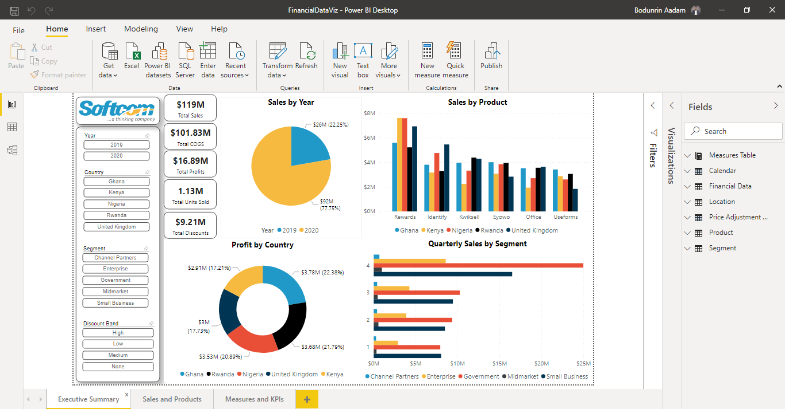
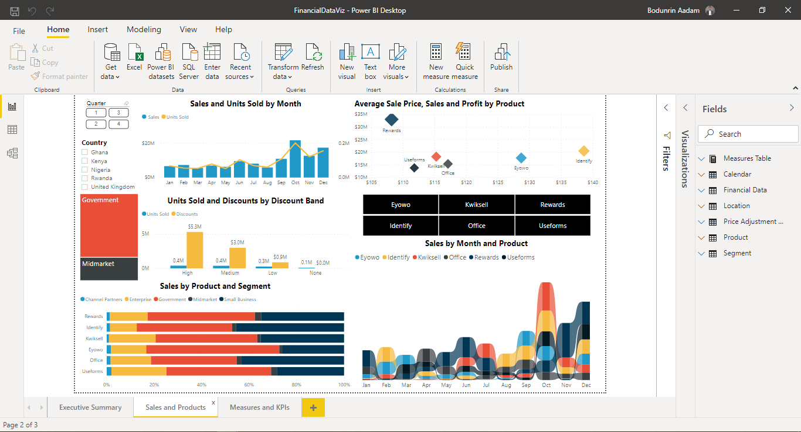
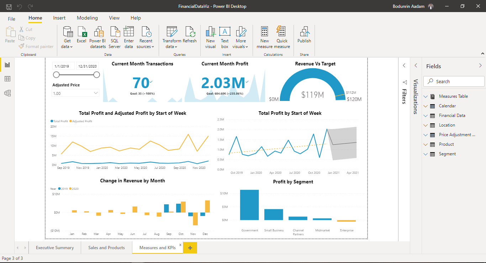

# Softcom Business Reporting & Intelligence Associate - Assessment

This project simply responds to a business intelligence assessment by [Softcom Nigeria](https://www.softcom.ng/) 

## Tools Used

- Microsoft Excel
- Power BI
- Power Point

With Excel, I was able to show several touch points on sales with relation to products, segment, and country.

On Power BI, I was able to show and share insights. At a glance, you can find them with the images below.

- Executive Summary  

- Sales and Products

- Measures and KPIs

Link to Repository can be located [here](https://github.com/AadamBodunrin/BIAnalysis).